### Actividad 3

<div id='content'/>
  
## Contenido
#### [Parte 1: Gestión de Usuarios](#id1)
#### [Parte 2: Gestión de Grupos](#id2)
#### [Parte 3: Gestión de Permisos](#id3)


<div id='id1'/>
  
# Parte 1: Gestión de Usuarios [ ⇧](#content)
- **Creación de Usuarios**
  
```
sudo useradd -m usuario1
```

```
sudo useradd -m usuario2
``` 
```
sudo useradd -m usuario3
``` 
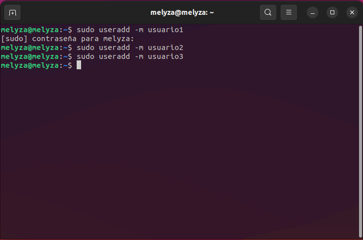

- **Asignación de Contraseñas**

```
sudo passwd usuario1
```

```
sudo passwd usuario2
```

```
sudo passwd usuario3
```
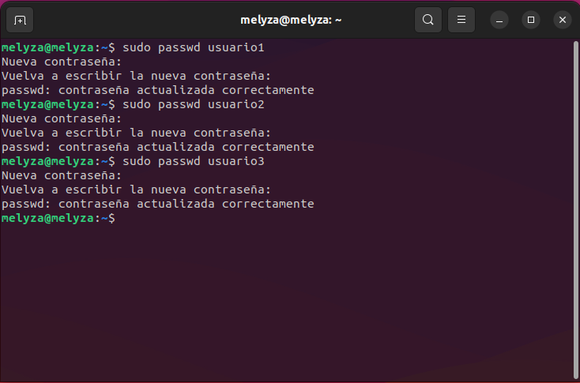

- **Información de Usuarios**

```
sudo passwd usuario1
```


- **Eliminación de Usuarios**

```
sudo userdel usuario3
```

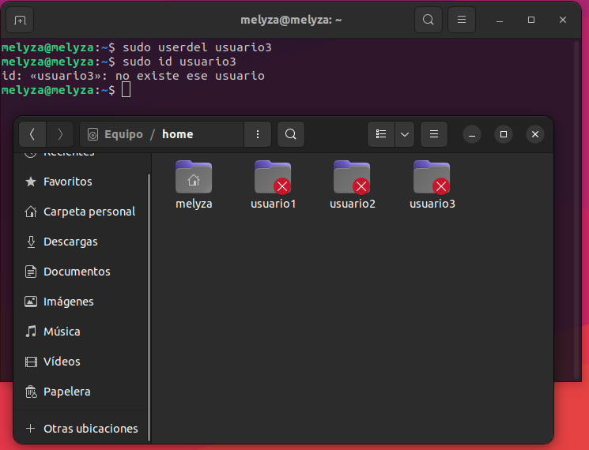

<div id='id2'/>
  
# Parte 2: Gestión de Grupos [ ⇧](#content)

- **Creación de Grupos**

```
groupadd grupo1
```

```
groupadd grupo2
```

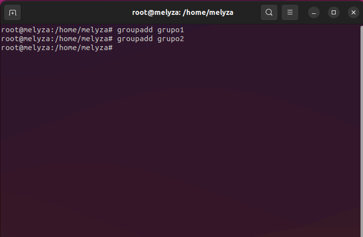

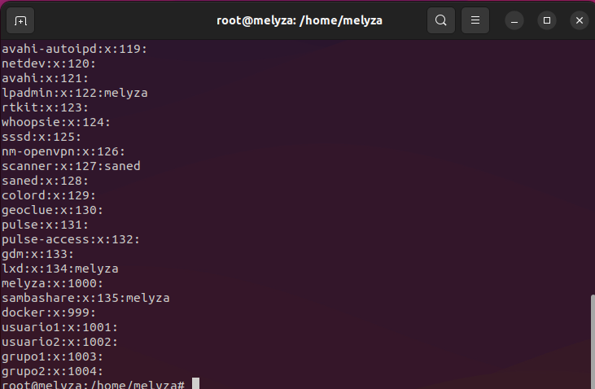

- **Agregar Usuarios a Grupos**

```
usermod -a -G grupo1 usuario1
```

```
usermod -a -G grupo2 usuario2
```
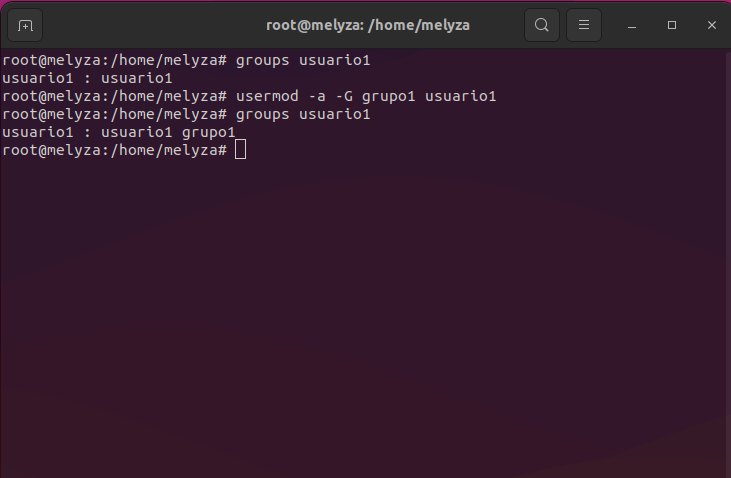

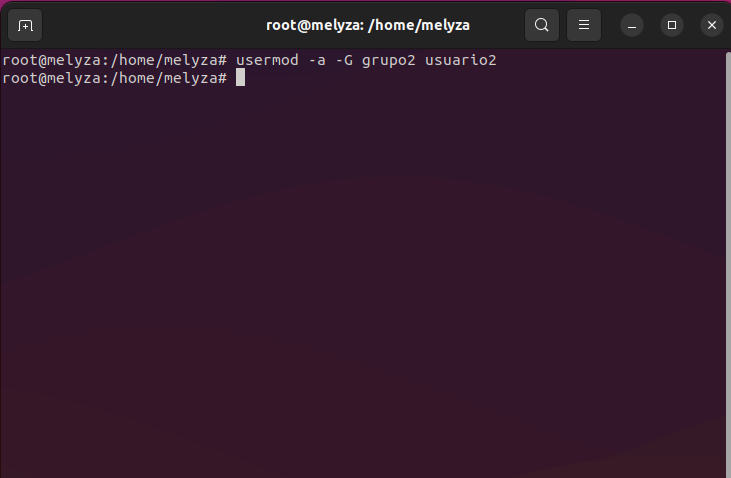

- **Verificar Membresía**
```
groups usuario1
```
```
groups usuario2
```


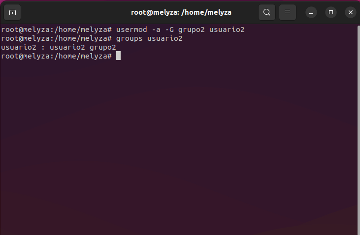

- **Eliminar Grupo**

```
groupdel grupo2
```

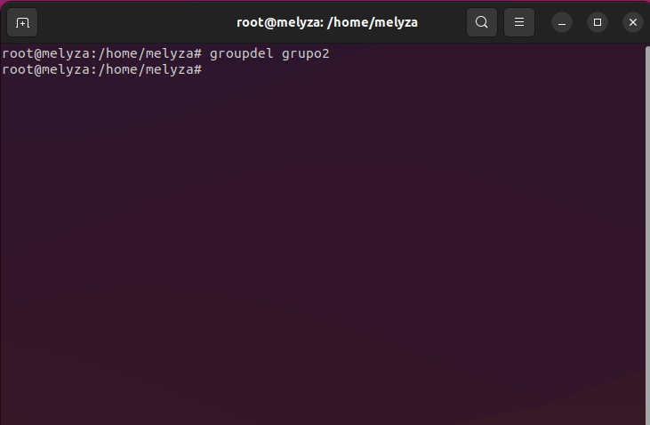
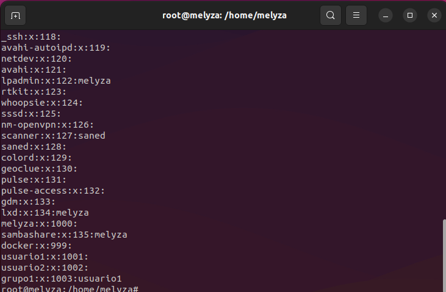
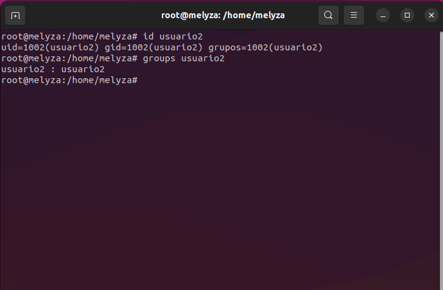

<div id='id3'/> 
  
# Parte 3: Gestión de Permisos [ ⇧](#content)

- **Creación de Archivos y Directorios**
> Ingreso a usuario1
> 
> 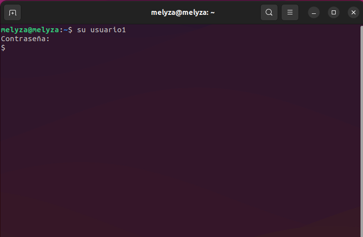

Creación de archivo en el directorio principal del usuario 

```
echo "contenido" > archivo1.txt
```
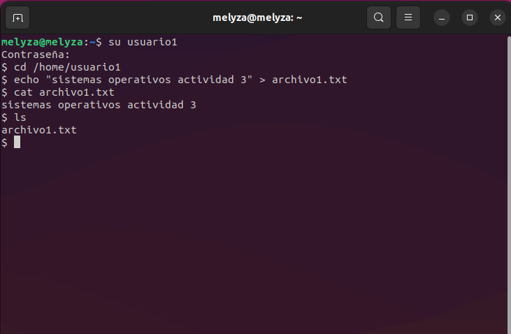

Creación de directorio ***/directorio1*** dentro del directorio principal del usuario 

```
mkdir directorio1
```
Creación de archivo dentro de ***/directorio1***

```
cd directorio1
```

```
echo "contenido" > archivo2.txt
```

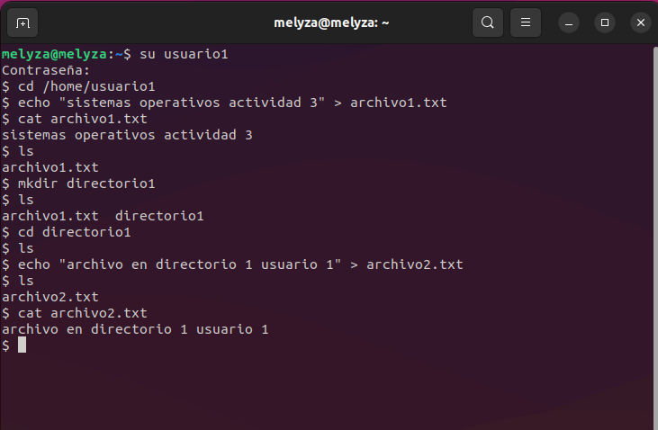

- **Verificar Permisos**

```
ls -l
```

```
ls -ld
```
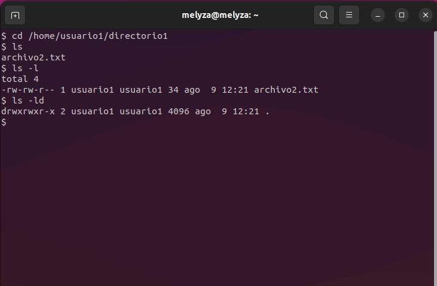

- **Modificar Permisos usando `chmod` con Modo Numérico**

```
chmod 640 archivo1.txt
```

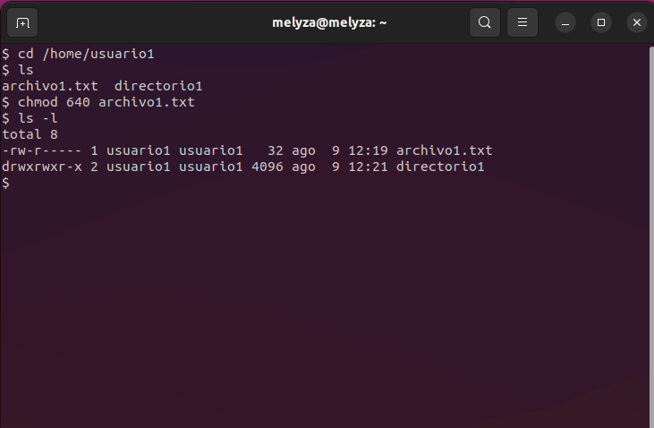

- **Modificar Permisos usando `chmod` con Modo Simbólico**

```
chmod u+x archivo2.txt
```

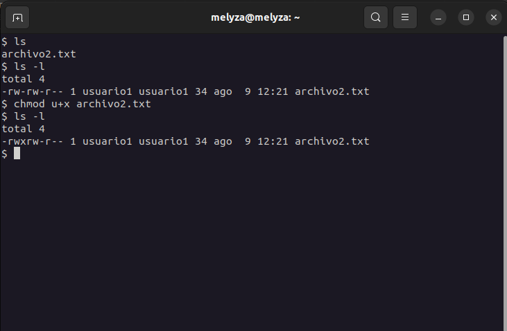

- **Cambiar el Grupo Propietario**

```
chown :grupo1 archivo2.txt
```

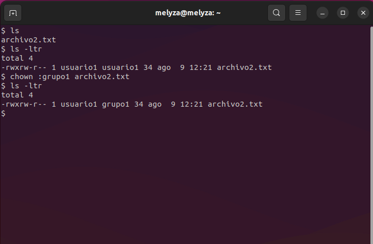

- **Configurar Permisos de Directorio**

```
chmod 740 directorio1
```

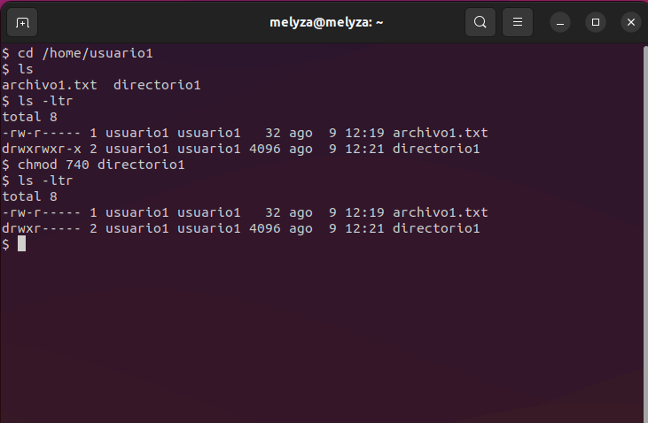

- **Comprobación de Acceso**

Accediendo al directorio principal del ***usuario1*** como ***usuario2***

```
cd /home/usuario1
```
Leyendo ***archivo2.txt*** como ***usuario2***

```
cat /home/usuario1/directorio1/archivo2.txt
```
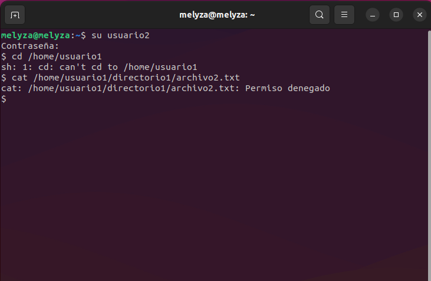

- **Verificación Final**

```
ls -l
```

```
ls -ld
```
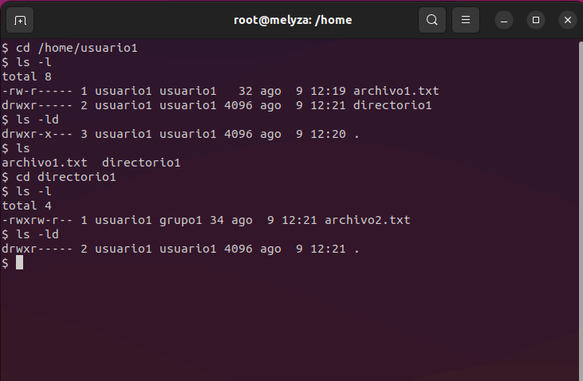

