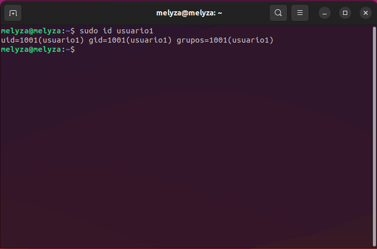

### Actividad 3

# Parte 1: Gestión de Usuarios
- **Creación de Usuarios**
  
```
sudo useradd -m usuario1
```

```
sudo useradd -m usuario2
``` 
```
sudo useradd -m usuario3
``` 


- **Asignación de Contraseñas**

```
sudo passwd usuario1
```

```
sudo passwd usuario2
```

```
sudo passwd usuario3
```


- **Información de Usuarios**

```
sudo passwd usuario1
```



- **Eliminación de Usuarios**

```
sudo userdel usuario3
```


