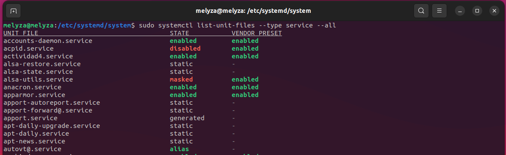

## Actividad 4

# Creación de un systemd unit de tipo servicio 

- Archivo ***actividad4.service***
```
[Unit]
Description=Actividad4
After=network.target

[Service]
Type=simple
ExecStart="/home/melyza/Escritorio/script.sh"

[Install]
WantedBy=default.target
```
  
