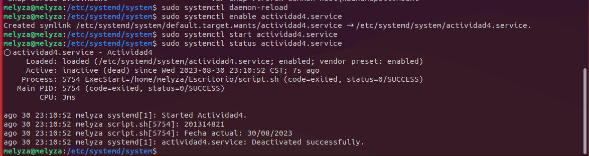

## Actividad 4

# Creación de un systemd unit de tipo servicio 

- Archivo ***actividad4.service***
```
[Unit]
Description=Actividad4
After=network.target

[Service]
Type=simple
ExecStart="/home/melyza/Escritorio/script.sh"

[Install]
WantedBy=default.target
```
  

El archivo se encuentra alojado en el siguiente directorio

``` /etc/systemd/system```


- Script que ejecuta el servicio ***script.sh**

```
#!/bin/bash
echo "201314821"
echo "Fecha actual: $(date +%d/%m/%Y)"
```


- Comandos utilizados

```
sudo systemctl daemon-reload

```

```
sudo systemctl enable actividad4.service

Salida:
Created symlink /etc/systemd/system/default.target.wants/actividad4.service → /etc/systemd/system/actividad4.service.

```

```
sudo systemctl start actividad4.service

```

- Verificando estado del servicio creado

Comando utilizado

```
sudo systemctl status actividad4.service

```



- Verificando informaciòn de los servicios

```
sudo systemctl list-unit-files --type service --all

```


